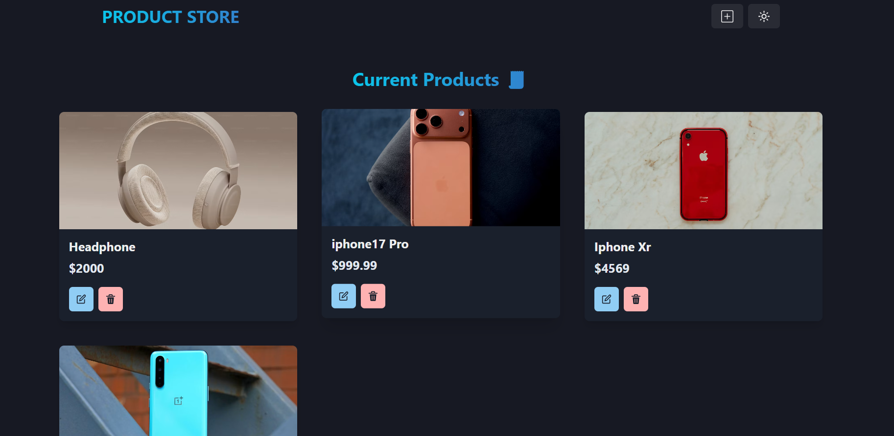

# MERN Product Store

A full-stack product management app built with the MERN stack. You can add products with an image URL, name and price, then edit or delete them. It has a light and dark theme.

Built while learning the MERN stack.



## Features

- Add a product with a name, price and image URL
- View all products as cards in a responsive grid
- Edit a product in a pop-up form
- Delete a product
- The page updates instantly, with no refresh needed
- Light and dark mode
- In production, the Express server also serves the built React app

## Tech Stack

**Frontend:** React 19, Vite, Chakra UI, React Router, Zustand, React Icons
**Backend:** Node.js, Express 5, Mongoose
**Database:** MongoDB

## Getting Started

### Prerequisites

- [Node.js](https://nodejs.org/) installed
- A MongoDB database (a free cluster on [MongoDB Atlas](https://www.mongodb.com/atlas) works well)

### Installation

1. Clone the repository:
```bash
   git clone https://github.com/DanishDeveloper1/MERN_Product_Store.git
   cd MERN_Product_Store
```
2. Install the backend and frontend dependencies:
```bash
   npm install
   npm install --prefix frontend
```
3. Create a `.env` file in the project root:
```
   MONGO_URI=your_mongodb_connection_string_here
   PORT=3000
```
   Keep `PORT=3000`, because the frontend dev server forwards `/api` requests to port 3000.
4. Start the backend (in one terminal):
```bash
   npm run dev
```
5. Start the frontend (in a second terminal):
```bash
   cd frontend
   npm run dev
```
6. Open `http://localhost:5173` in your browser.

### Production build

```bash
npm run build
npm start
```
The app is then served by Express at `http://localhost:3000`.

## API Endpoints

Base URL: `/api/products`

| Method | Endpoint            | Description             |
|--------|---------------------|-------------------------|
| GET    | `/api/products`     | Get all products        |
| POST   | `/api/products`     | Create a new product    |
| PUT    | `/api/products/:id` | Update a product by ID  |
| DELETE | `/api/products/:id` | Delete a product by ID  |

### Product fields

| Field | Type   | Required |
|-------|--------|----------|
| name  | String | Yes      |
| price | Number | Yes      |
| image | String | Yes      |

## Project Structure

```
backend/
  config/        database connection
  controllers/   request handlers
  models/        Mongoose schema
  routes/        API routes
  server.js      Express server
frontend/
  src/
    components/  Navbar, ProductCard
    pages/       HomePage, CreatePage
    store/       Zustand store (API calls)
```

## Author

Md Danish - [GitHub](https://github.com/DanishDeveloper1) | [LinkedIn](https://www.linkedin.com/in/danishdeveloper)
